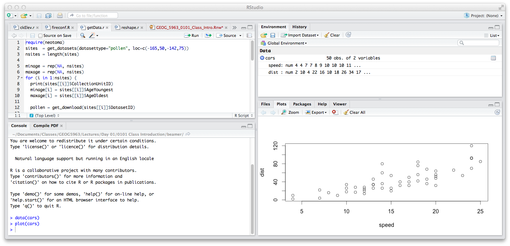

# Introduction

This lab is designed to give you a brief introduction to using spatial data in [R][rID]. For students with no prior experience of R, the first section provides a very brief introduction, covering reading and writing files and accessing variables. If you have already used R, you can skip this and go straight to the main section, which covers creating, importing and exporting spatial data types, and some examples for visualizing the data. A short example of running basic geostatistical analysis using the **gstat** package is also included. 

You can use R as it is, but for this course we will use R in combination with the [RStudio][rsID] interface (also freeware), which has a well organized layout and several extra options. *As you work through the lab, you should read the help documents for the functions you use as well as try different parameters or variables.* 

## A quick note on formatting

Code that can be entered into R will be high-lit, e.g.:

```{r eval=FALSE}

plot(x,y)

```

And R output will be formatted with `##` at the start of the line. File names will be given in *italics* and will be available through the CMES server. 

## Linking to CMES data

To get access to the data files, simply connect to my data directory on the CMES server. To do this under Mac OSX, open the 'data' shortcut on your desktop, then go to the Finder menu at the top of the screen. Choose [Go] > [Go to Folder]. When the dialog box opens up asking which folder to go to, simply type my University ID 'u0784726', and this should open my data directory. Copy to the file 'Spatial R Lab.zip', which contains this file and the data files needed for the lab to your 'home' directory. Unzip the file to create a directory called 'Spatial R Lab'. In this folder, you find this html file, as well as a subfolder called `data` that contains any files we will need. 

# Brief introduction to R

This section is designed for students with no prior experience of R. Others can skip ahead to the section "Spatial Objects"

## RStudio layout

The RStudio interface consists of several windows. Start RStudio from the 'Start' menu under Windows, and the following window should appear:



- Bottom left: 'Console window' (also called command window). Here you can type simple commands after the \>" prompt and R will then execute your command. This is the most important window, because this is where R actually does stuff.
- Try typing a simple calculation here, e.g.: `1 + 1`, which should (hopefully) give the answer `2`. Note that R is insensitive to white space, and `1+1` or `1   +1` will all do the same thing
- Top left: 'Editor window' (also called script window). Collections of commands (scripts) can be edited and saved. When you don't see this window, you can open it with [File > New > R script]. Just typing a command in the editor window is not enough, it has to get into the command window before R executes the command. If you want to run a line from the script window (or the whole script), copy and paste it to the console. Alternatively, you can click [Run] or press CTRL+ENTER to send it to the command window.
- Top right: 'Workspace / history window'. In the workspace window you can see which data and values R has in its memory. You can view and edit the values by clicking on them. The history window shows what has been typed before.
- Bottom right: 'Files / plots / packages / help window'. Here you can open files, view plots (also previous plots), install and load packages or use the help function. You can change the size of the windows by dragging the grey bars between the windows.

As you will be typing a lot of commands in R, sometimes with quite complex syntax, it is **highly** recommended that you use scripts to record successful commands as you progress (you can copy and past from the console to the script editor). This allows you to go back and easily re-run these or modify them as you go along, or to transfer your analysis to another computer or another user. Note that just typing a command in the editor window is not enough, it has to get into the command window before R executes the command. If you want to run a line from the script window (or the whole script), copy and paste it to the console (or highlight it and press 'Cmd-Enter' or 'Ctrl-Enter'). 

If you are using base R, you will only see the console and the plot window. Other windows (e.g. help) can be opened from the menu or during a working session. 

## Working directory

R defines the working directory as the folder in which it is currently working. When you ask R to open a certain file, it will look in the working directory for this file, and when you tell R to save a data file or plot, it will save it in the working directory. 

Before doing anything else them we need to change R's working directory so that it is pointing to the folder you just created (`Spatial R Lab`). The easiest way to do this is by going to the [Session] menu in RStudio, then [Change working directory]. This will open a file browser that you can use to browse through your computer and find the folder. (If you are using the base version of R, go to [File] $>$ [Change dir...] in Windows, or [Misc] $>$ [Change Working Directory] in Mac.)

## Reading data from files

R can use many different file types, but comma-separated value (csv) files are recommended as the easiest way to transfer between R and Excel. For examples, we are going to use a dataset of morphological measurements of three species of penguin. More information about this dataset can be found here: [https://allisonhorst.github.io/palmerpenguins/index.html](https://allisonhorst.github.io/palmerpenguins/index.html)

Let's get a list of files in the `data` folder as follows (note the use of the `pattern` parameter to filter the list of files returned):

```{r}

list.files("./data/", pattern=".csv")

```

The *penguins.csv* file is the one we need. To read this in, we use the `read.csv()` function. Note that we use the assignation operator (`<-`) to create an R data frame called `penguins`. This stores a copy of the data in the file, and it is what you will work with. 

```{r}

penguins <- read.csv("./data/penguins.csv")

```

To check to see that the dataframe has been created and is available use, you can use the `ls()` function to list all available R objects. You can also check this in the 'Environment' tab in RStudio. 

```{r}

ls()

```

R will store data read from CSV filesin  a *dataframe*. To print out the contents of any object, simply type the name of that object at the command prompt. Other useful commands are `class()` to see what data class a object is, and `names()` to get a list of the column headers. The function `str()` reports the structure of the object, describing the column names and the type of data stored in them.

```{r, results='hide'}

penguins
class(penguins)
names(penguins)
str(penguins)

```

## Manipulating variables in R

In order to access the values in a dataframe or other R object, there are two main methods: column notation and indexing. Column notation uses the dollar sign (`$`) after the name of dataframe, with the column name appended (note that R replaces any white spaces in the column names with '`.`'). For example:

```{r, results='hide'}

penguins$species
penguins$bill_length_mm

```

Indexing uses a coordinate system to access variables. These are given in brackets after the name of the object, and take as many indexes as there are dimensions of the data object. So for a 1D vector, we require one, for a 2D matrix or data frame, we require two, etc. For matrices and data frames, the indices are [row,column]. If either of these are left blank, then all rows (or columns) are selected:

```{r, results='hide'}

penguins[ ,1:4]  		# Columns 1 to 4
penguins[1:10, ]			# First 10 rows
penguins[1:20,1:2]	# Indices can be combined
penguins$bill_length_mm[1:25]	# Note that indices can be combined
penguins$bill_length_mm[3]  		# 3rd element
penguins$bill_length_mm[-3]		# All but 3rd element

```

## Writing data to files

Variables created in R may also written out to csv files using the `write.csv()` function. As an example we create a variable that is the ratio of bill length to bill depth. By using the `$` notation, we can create a new column in the `penguins` dataframe:

```{r, results='hide'}

penguins$bld_ratio = penguins$bill_length_mm / penguins$bill_depth_mm
names(penguins)

```

Note that this new column only exists in R's copy of the data. If you want to save this to a file for future use, you'll need to write it out:

```{r, results='hide'}

write.csv(penguins, "test.csv")

```

This will write a csv file called *test.csv* in your working directory, containing the all the original penguins data values plus the new vector of length/depth ratios. Note that R uses the variable name as a column header and adds a column with line numbers. You can remove the line numbers by adding the parameter `row.names=FALSE` to the `write.csv()` function. 

## Some basic statistical functions

We will now look at some simple functions in R to analyze the penguins data. To start, let's check the types of data that are available:

```{r}

str(penguins)

```

This shows that the data are a mix of numeric (floating-point), integer and character strings (e.g. the species name). R has a additional data type called *factors* which can be used to group character strings together (we'll see examples of this later). This is useful here, as it would allow us to analysze all penguins from the same species together. We can convert the vector of species names to factors using `as.factor()`:

```{r}

penguins$species = as.factor(penguins$species)

```

Each unique string is now considered as a level in this factor grouping. If you now print the content of the vector by typing `penguins$species`, you should see the set of species names after the output. Note that you can avoid this skip by reading in the data with the argument `stringsAsFactors = TRUE` in `read.csv()`

R has a large number of inbuilt functions. This section is designed to simply introduce you to the some basic functions for describing data. To find out more about the functions, and how you can change parameters, use the `help()` function or the `?` operator, e.g.:

```{r eval = FALSE}

help(mean)
?mean

```

This will open a window with the help file for that function. If you do not know the name of a function, there is a search function `help.search()`. Alternatively, use Google, StackOverflow or [RDocumentation][rdocID] to search more broadly. 

### Functions to describe the central tendency:

Let's start by calculating the mean:
```{r, results='hide'}

mean(penguins$bill_depth_mm)

```

Well, that didn't work. The data we are trying to estimate the mean from have a couple of missing values, and R's default behavior is to not calculate anything. If you add the argument `na.rm = TRUE`, R will ignore these and then just use the remaining values:

```{r, results='hide'}

mean(penguins$bill_depth_mm, na.rm = TRUE)

```

You can also calculate the median

```{r, results='hide'}

median(penguins$bill_depth_mm, na.rm = TRUE)

```

### Functions to describe the dispersion:

```{r, results='hide'}

sd(penguins$bill_length_mm, na.rm = TRUE) ## Standard deviation
var(penguins$bill_length_mm, na.rm = TRUE) ## Variance
min(penguins$bill_length_mm, na.rm = TRUE) ## Minimum
max(penguins$bill_length_mm, na.rm = TRUE) ## Maximum
range(penguins$bill_length_mm, na.rm = TRUE) ## Min and Max
quantile(penguins$bill_length_mm, na.rm = TRUE) ## Quantile (50% by default)

```

Note that `quantile()` takes a parameter that allows you to choose the quantile to be calculated, e.g. `quantile(age, c(0.1,0.9))`, will calculate the 10th and 90th percentile. I highly recommend that you read the help pages for these functions to understand what they do and how they can be modified. 

## Functions to assess the relationship between pairs of variables.

Standard functions include calculation of the covariance and correlation. Let's estimate these values for the bill length and body mass. The argument here to skip the missing values is a little different. 

```{r, results='hide'}

cov(penguins$bill_length_mm, penguins$body_mass_g,
    use = 'pairwise.complete.obs')
cor(penguins$bill_length_mm, penguins$body_mass_g,
    use = 'pairwise.complete.obs')

```

The correlation function gives Pearson's coefficient by default, but can be changed by setting the `method` parameter. The correlations obtained can be tested against a null hypothesis of no correlation by using the `cor.test()` function. 

```{r, results='markup'}

cor.test(penguins$bill_length_mm, penguins$body_mass_g,
         use = 'pairwise.complete.obs') 

```

### The `tapply()` function

The file contains observations for three different species of penguin. As we converted the vector of species names to a factor, R can use this to calculate statistics by group using the `tapply()` function. This takes three arguments: the vector of values, the vector of factors and the statistic to calculate. So to get the mean sepal width of the three species:

```{r}

tapply(penguins$bill_length_mm, penguins$species, mean, na.rm = TRUE)

```

You can easily estimate other summary statistics by replacing `mean`. Try calculating the standard deviation for each species.

### Some other useful functions:

`levels()` and `table()` are very useful for summarizing factor data (`table()` can also be used to make cross tables). `sum()` calculates the total for a numeric column. The `summary()` function is one of the most important as it is used frequently in R to print output from analysis as well as summary statistics. It's also a great way to check for mssing values in your data.

```{r, results='hide'}

levels(penguins$species)
table(penguins$species)
sum(penguins$bill_length_mm, na.rm = TRUE)
summary(penguins$bill_length_mm)
summary(penguins)

```

## Plotting

### Univariate plots

Histograms are commonly used to summarize data, where values are 'binned' into a set of classes, and the histogram represents the frequency of occurrences in that bin. The function `hist()` in R produces a histogram. Bins are defined with the `breaks` parameter, which may be set to a constant number in which case the data range is split into that many bins, or as a sequence of numbers defining the intervals between bins. In this latter case, we can make use of the `seq()` function which produces a vector of regularly spaced numbers: 

```{r, fig.keep='none'}

hist(penguins$body_mass_g, 
     breaks=20, main="Histogram of body mass", xlab = "g")
hist(penguins$body_mass_g, 
     breaks=seq(2500,6500,500),
     main="Histogram of sepal lengths")

```

An alternative to histograms are boxplots, which show information about the data quartiles. Here the box represents the interquartile data (25-75% of the data), the thick bar is the median, and the 'whiskers' show the data range.

```{r, fig.keep='none'} 

boxplot(penguins$body_mass_g,
        main = "Boxplot of body mass",
        ylab = "g")

```

To make this more useful, we can produce a boxplot for each of the three species of Iris. We do this using the *model formula* in R. This is denoted by using the tilde (`~`), which defines a relationship between the dependent variable (on the left of the tilde) and the independent variable (on the right). Here we want to plot sepal lengths dependent on the species:

```{r}

boxplot(body_mass_g ~ species,
        data = penguins,
        main = "Boxplot of body mass",
        ylab = "g")

```

### Bivariate plots

Bivariate plots are designed to show the relationship between two variables, and how this may vary. The simplest form is the scatter plot. We use the `plot()` function again, but now we give it two variables (x and y). We can use this to visualize the relationship between petal length and sepal length:

```{r}

plot(penguins$bill_length_mm, penguins$body_mass_g)

```

The `plot()` function has a large number of parameters to help modify the figure. Here, we will simply add two parameters to change the symbols: `pch` which defines the plotting symbol and `col` which defines the symbol color. We also add a x and y label:

```{r, fig.keep='none'}

plot(penguins$bill_length_mm, penguins$body_mass_g, 
     pch = 16, col = 2,
     xlab = 'Bill length (mm)', ylab = 'Body mass (g)')

```

Rather than using the same color for all points, we can use a vector defining a color for each individual point. Here, we do this by using the vector `sp` to color each point according to the species, which shows a clear separation of morphology for the three species:

```{r, fig.keep='none'}

plot(penguins$bill_length_mm, penguins$body_mass_g, 
     pch = 16, col = penguins$species,
     xlab = 'Bill length (mm)', ylab = 'Body mass (g)')

```

### Line plots

Line plots are a good way to visualize data that forms a natural series, e.g. time series. We will illustrate how to do this in R using the Mauna Loa monthly CO~2~ data in the file *co2_mm_mlo.csv*. Get this file and read it into R using `read.csv()`, then use the `names()` function to see the column names. The column 'decdate' contains decimal dates (i.e. as a decimal between two years) and can be used for the x variable. We'll start by plotting the interpolated CO~2~ values against these dates:

```{r echo=FALSE}

co2 = read.csv("./data/co2_mm_mlo.csv")

```
```{r}

plot(co2$decdate, co2$interpolated, type='l')

```

As before, we can use the `xlab` and `ylab` parameters to improve the axis labels, and we can change the color (`col`) and thickness (`lwd`) of the line:

```{r eval=FALSE}

plot(co2$decdate, co2$interpolated, type='l', 
     xlab="Date", ylab="ppm", main="Mauna Loa CO2 record",
     lwd=2, col="red")

```

We can add a second series to the plot using the `lines()` function. Here we'll add the trend line from the file to the current line:

```{r eval=FALSE}

lines(co2$decdate, co2$trend, lwd=2, col=3)

```

A similar function (`points()`) can be used to add points to an existing plot. 

# Spatial data in R

R has a series of add-on packages designed for use with spatial data. The packages we need are preinstalled on the lab computers, so you can ignore this step if you are using one of these. If you are using your own computer, you may need to install these before proceeding. To install a package, either use the `Install` button from the 'Packages' tab, or use the following command, where *nameofmypackage* is the package you wish to install:

```{r eval=FALSE}

install.packages("nameofmypackage")

```

For this lab, we will need the following packages:
- **sf**: defines a set of spatial objects for R using simple features. These include point, line and polygon vectors and gridded/pixel raster data
= **stars**: defines classes for spatiotemporal data
- **gstat**: geostatistical interpolation
- **RColorBrewer**: color scales for maps

We will also use a package developed by Gabe to access and analyze water isotope data called **isoWater**. This depends on an additional piece of software for Gibbs sampling called JAGS. Again, this is preinstalled on the lab computers, but you will need to install if you are working on your own laptop. You can download installers for JAGS [here][jagsID]. Once you've successfully installed this, you can then install the **isoWater** package in R using the methods described above. If you run into any problems during these installation steps, please ask for help!

**IF YOU ARE USING MAC OSX THIS LIBRARY MAY NOT INSTALL. IF SO, FOLLOW THE ADDITIONAL INSTRUCTIONS BELOW MARKED `MACOSX`**

Once installed, you will need to load each package into R's workspace in order to use it using the `library()` function. For the moment, we'll just load the **sf** package:

```{r eval=TRUE, message=FALSE}

library(sf)

```

**Note that packages only need to be installed once, but need to be loaded every time you restart R.** 

## Reading spatial data

The easiest way to get spatial data into R is to export it from a GIS package in a standard vector or raster format. Shapefiles are one of the most commonly used formats for vector data, and the **sf** package includes a function (`st_read()`) for reading these directly into R as spatial objects. 

We'll start by reading in a shapefile with county boundaries for Utah. make sure that this is unzipped in your `data` folder, and read it in as follows:

```{r message=FALSE}

ut_cnty <- st_read("./data/utahcounty/utahcounty.shp")
class(ut_cnty)

```

The data is read into a simple feature or `sf` object, which is simply a modified data frame. This include an additional column called `geometry` which contains the coordinate information for each observation. 

```{r }

head(ut_cnty)

```

As this is a spatial object, it also has a number of specific attributes, including:

- The bounding box

```{r message=FALSE, results='hide'}

st_bbox(ut_cnty)

```

- The set of coordinates (this will be printed as one line per polygon vertex) 

```{r message=FALSE, results='hide'}

st_coordinates(ut_cnty)

```

- The coordinate reference system (information about the projection used for the data):

```{r message=FALSE, results='hide'}

st_crs(ut_cnty)

```

As this has not yet been set, it simply returns a missing value or `NA`. As we know this data is in a longitude/latitude based on the WGS84 ellipsoid, we can add this information as a coordinate reference system with the function `st_crs()`. Adding this information will allow you to re-project the data to match other datasets (an example of this is provided later). 

Several methods exist to identify a CRS, but by far the easiest is to use its EPSG code. To find the EPSG code for a CRS, you can visit this website: [spatialreference.org](https://spatialreference.org/). For these data, the EPSG code is 4326:

```{r message=FALSE}

st_crs(ut_cnty)
st_crs(ut_cnty) <- 4326
st_crs(ut_cnty)

```

Once set, the CRS is printed in WKT format, a standard for spatial data. 

Next, we'll load some isotope data using the **isoWater** package. If you were not able to install this for any reason, see the appendix below for code to read an earlier version of this data from a shapefile. Start by loading the library

```{r message = FALSE, eval = FALSE}

library(isoWater)

```

Now use the function `wiDB_data()` to download the data. Here we restrict the data to stream and river samples from Utah. See `help(wiDB_data)` for other criteria that can be used to refine your search. 

```{r eval = FALSE}

ut_wi_db = wiDB_data(states = "UT", types = "River_or_stream")

```

This will create a new R list object (`ut_wi`) containing both the data and metadata relating to the provenance of the data. The data can be converted to an `sf` object using `st_as_sf()`, by providing the name of the dataframe and the columns containing the x and y coordinates and (optionally) the CRS. 


```{r eval = FALSE}

ut_wi <- st_read()

```

```{r eval = FALSE}

ut_wi <- st_as_sf(ut_wi_db$data,
                  coords = c("Longitude", "Latitude"),
                  crs = 4326)

```

As before, we can inspect various spatial attributes of the data:

```{r message=FALSE, results='hide'}

ut_wi <- st_read("data/UT_WI2/ut_wi2.shp")

st_bbox(ut_wi)
# st_coordinates(ut_wi)
st_crs(ut_wi) <- 4326
ut_wi$WI_Analysis_Source <- ut_wi$WI_Analy_2

```

We can access the data in the attribute table in the same way that we use a data frame. To find the names of the variables in this table type:

```{r results='hide'}

names(ut_wi)

```

For example, to get the d18O values, type:

```{r results='hide'}

ut_wi$d18O

```

And we can calculate the usual statistics or make descriptive plots:

```{r results='hide', fig.keep='none'}

summary(ut_wi$d18O)
hist(ut_wi$d18O, breaks=20)

```

To get a simple plot of the points, we first need to extract the spatial geometry using `st_geometry()` then uyse the `plot()` function (we'll look at some better plotting options below):

```{r fig.keep='none'}

plot(st_geometry(ut_wi))

```

R's conditional selection can be used to cut out various parts of the data object. For example, the name of the group who provided the data is held in the column 'WI_Analy_2'. We can use this to create a new spatial point object containing only these data, then make a plot showing where these locations are compared to the full dataset:

```{r fig.keep='high'}

ut_wi_spatial = ut_wi[ut_wi$WI_Analysis_Source == "SPATIAL", ]
plot(st_geometry(ut_wi), axes=TRUE)
plot(st_geometry(ut_wi_spatial), col="red", add = TRUE)

```

The **sf** package can also make simple thematic maps by specifying a column to plot:

```{r  fig.keep='none'}

plot(ut_wi["d18O"], pch = 16)

```

Or categorical variables by first converting them to factors:

```{r fig.keep='none'}

ut_wi$WI_Analysis_Source <- as.factor(ut_wi$WI_Analysis_Source)
plot(ut_wi["WI_Analysis_Source"], pch = 16)

```

## Gridded objects

As with the other types of objects, SpatialGrid objects exist with and without associated data frames. The first type (SpatialGridDataFrames) are used for storing raster data (remote sensed images, gridded climate fields, etc). The second type are less useful as they contain no data, only the grid topology. 

The **stars** package includes a function (`read_stars()`) for reading raster files in various formats (including ESRI gridded formats, GeoTIFFs, etc). The file *predkrig2.asc* contains a raster data set with interpolated values of winter season H isotope ratios of precipitation from IsoMAP. The file can be read in as follows (note that we again add the projection information by hand):

```{r fig.keep='none', results='hide', message=FALSE}

library(stars)
win_d2h <- read_stars("./data/predkrig2.asc")
st_crs(win_d2h) <- 4326
class(win_d2h)

```

You can make a simple plot of the `stars` object as follows:

```{r}

plot(win_d2h)

```

By default, the file name is used to assign a variable name. We can change this to something more meaningful:

```{r}

names(win_d2h) <- "d2H"

```

## R as a GIS

The **sf** package also adds some basic GIS functionality to R. For example, we use the county polygons to clip other layers. Start by creating a new polygon, just representing Salt Lake County:

```{r fig.keep='none'}

slc = ut_cnty[ut_cnty$NAME=="SALT LAKE",]
plot(st_geometry(slc))

```

We can now use this to clip out only the samples falling in this region:

```{r fig.keep='none'}

slc_wi = ut_wi[slc,]
plot(st_geometry(slc), main = "Salt Lake County")
plot(st_geometry(slc_wi), col=3, pch = 16, add=TRUE)

```

We can also crop out the part of the IsoMAP grid for this county (try not to be overwhelmed by the fine resolution). 

```{r fig.keep='none'}

slc_d2h = win_d2h[slc,]
plot(st_geometry(slc))
plot(slc_d2h, add = TRUE)

```

The `st_extract()` function does overlay calculations. For example, we can get the value of the gridded data at each of the isotope point locations as follows:

```{r results='hide'}

st_extract(win_d2h, at = ut_wi)

```

We can do the same with the polygon data using the `aggregate()` function. The function used to aggregate all pixels within a polygon can be specified using the `FUN` parameter. We calculate and plot the mean and standard deviation:

```{r fig.keep='none'}

tmp = aggregate(win_d2h, ut_cnty, FUN = mean)
ut_cnty$mean_d2h = tmp$d2H
plot(ut_cnty["mean_d2h"])

```

# Visualizing spatial data with the **tmap** package

The basic plotting function provided with the **sf** package provides a simple way to map out data with a simple color scale (e.g. `plot(ut_wi["d18O"])`). However, it is relatively inflexible if you want to make more complex maps. An add-on package (**tmap**) provides several functions to improve on this. This builds maps as a series of layers, with different symbols or shadings added for each layer. You can then add further map objects (e.g. scale bar, north arrow). Make sure this package is installed, then try working through the following examples:

```{r message=FALSE}

library(tmap)
tm_shape(ut_cnty) +
  tm_fill("mean_d2h")

```

Further layers can be added to the plot by adding a new layer with `tm_shape` then adding the variable to add). Here, we'll first add the county outlines using `tm_borders()`, then use `tm_dots` to show the location of the samples in the `ut_wi` `sf` object. We'll also move the legend outside of the map:

```{r fig.keep='none'}

tm_shape(ut_cnty) +
  tm_fill("mean_d2h") +
  tm_borders() +
  tm_shape(ut_wi) +
  tm_dots() +
  tm_layout(legend.outside = TRUE)

```

The **tmap** packahe comes with a large number of predefined color palettes for maps. You can visualize these using the **tmaptools** pacakge (this is another add-on), and the `palette_explorer()` function. Here, we'll use one of the viridis color palettes (`magma`) to 

```{r fig.keep='none'}

tm_shape(ut_cnty) +
  tm_fill("mean_d2h", palette = "viridis") +
  tm_borders() +
  tm_shape(ut_wi) +
  tm_dots() +
  tm_layout(legend.outside = TRUE)

```

You can also modify the intervals on the palette using `style` (see the help page for *lots* of detail on this argument):

```{r fig.keep='none'}

tm_shape(ut_cnty) +
  tm_fill("mean_d2h", palette = "viridis", style = "quantile") +
  tm_borders() +
  tm_shape(ut_wi) +
  tm_dots() +
  tm_layout(legend.outside = TRUE)

```


Similar approaches can be used with point data. Here we estimate the value of the IsoMAP layer at the points in Salt Lake Country, and then plot this, together with the county outlines (as a dashed line). 

```{r fig.keep='none'}

slc_wi = st_extract(win_d2h, at = slc_wi)
tm_shape(slc_wi) +
  tm_symbols(col = "d2H", palette = "Blues", alpha = 0.5) +
  tm_shape(slc) +
  tm_borders()

```

And with gridded data:

```{r}

tm_shape(win_d2h) +
  tm_raster("d2H", palette = "-inferno") +
  tm_layout(legend.outside = TRUE, title = "Winter d2H") + 
  tm_compass(position = c("left", "bottom")) + 
  tm_scale_bar(position = c("right", "bottom")) 

```

Adding an overlay of the Utah counties:

```{r}

tm_shape(win_d2h) +
  tm_raster("d2H", palette = "-inferno", style = 'cont') +
  tm_layout(legend.outside = TRUE, title = "Winter d2H") + 
  tm_shape(ut_cnty) +
  tm_borders() +
  tm_compass(position = c("left", "bottom")) + 
  tm_scale_bar(position = c("right", "bottom")) 

```

Note that any **tmap** plot can be shown as an interactive map by setting the mode to `view`. For example (not run here):

```{r eval = FALSE}

tmap_mode("view")
tm_shape(ut_cnty) +
  tm_fill("mean_d2h", palette = "viridis", style = "quantile") +
  tm_borders()

```

You can reset to a non-interactive model by running `tmap_mode("plot")`. 

# Geostatistics in R

R has several packages for spatial analysis including standard kriging methods, random fields, spatial regression and point process analysis. The [Spatial taskview][taskSpatialID] on the CRAN website lists the recommended packages for each of these. 

We will use on of these **gstat** to carry out a quick variogram analysis and interpolation of the isotope data. This package, developed by Edzer Pebesma, has functions for variogram calculation, visualization and modeling, as well as methods for various types of kriging (simple, ordinary, cokriging) and simulation. 

We'll use this here to analyze part of the Utah Water Isotope dataset loaded earlier. As this contains a large number of samples derived from different sources, we'll cut out a subset consisting of the tap water isotopes recorded by the SPATIAL group as follows:

```{r results='hide'}

ut_wi_spatial = ut_wi[ut_wi$WI_Analysis_Source == "SPATIAL", ]
dim(ut_wi_spatial)

```

The output from the `dim()` function shows that we have `r dim(ut_wi_spatial)[1]` samples left in this subset. However, some of these represent repeat samples from the same location. This can present a problem for kriging as these samples will have a distance of zero which causes matrix singularities. Here, we simply remove duplicate samples (a better method would be to average these). 

```{r message=FALSE}

ut_wi_spatial = st_difference(ut_wi_spatial)

```

Next, we'll make up a grid of points for predictions. We could use the grid we read in earlier (`win_d2H`), but instead we'll make up our own grid just covering Salt Lake County. We first extract the bounding box of the county outline, then use this to create a grid with `st_as_stars`. Note that we can set the grid resolution here. We then set the CRS, and finally clip this to the county shapefile. 

```{r message=FALSE}

mybbox = st_bbox(slc)
grid = st_as_stars(mybbox, dx = 0.01, dy = 0.01)
st_crs(grid) = 4326
grid = grid[slc, ]

```

Next, we need to load the **gstat** package, and use it to calculate and visualize the sample variogram of the d18O data in the subset, using the `variogram()` function. As we have previously set the projection parameters for this dataset to a geographical projection, this automatically uses great circle distances in the variogram calculations, so the units on the x-axis are in kilometers. 

```{r}

library(gstat)
d18O.var = variogram(d18O ~ 1, ut_wi_spatial)
plot(d18O.var, numbers = TRUE)

```

Note that we can also set the cutoff (maximum range over which distances are calculated), and the width of each distance lag (see `help(variogram)` for more details). As the variogram appears to plateau at around 40km, we might want to reduce the cutoff distance and the lag size:

```{r  fig.keep='none'}

d18O.var = variogram(d18O ~ 1, ut_wi_spatial, cutoff=60, width=2.5)
plot(d18O.var)

```

Try different values to see the effect on the variogram. 

The next step is to fit a variogram model to capture this spatial structure. To start, we fit a model by eye. We need to specify: a) the model form; b) the value of the nugget (the intercept with the Y axis); c) the model range (the distance at which the sample variogram becomes flat); d) the sill, the semivariance value (y-axis) of the range. Here we specify these as separate variables, then use the `vgm()` function to build our model. [If you are working with the shapefile data, you will need to alter the `modSill` and `modNugget` values to something a little lower.]

```{r fig.keep='none'}

modSill = 6
modRange = 40
modNugget = 2
d18O.vgm1 = vgm(psill=modSill, "Sph", range=modRange, nugget=modNugget)
plot(d18O.var, d18O.vgm1)

```

The fit is only approximate to the data, so we can now use an iterative weighted OLS method (`fit.variogram()`) to fit the model variogram to the sample variogram. 

```{r fig.keep='none'}

d18O.vgm2 = fit.variogram(d18O.var, d18O.vgm1) 
plot(d18O.var, d18O.vgm2)

```

And we can output the parameters from the fitted model:

```{r}

d18O.vgm2

```

We now use our fitted model to predict d18O values. The `krige()` function performs spatial prediction, using ordinary kriging as a default. This requires a set of input:
- A model formula specifying the variable to be predicted (this can be extended to include covariates, here we add '1' as no covariates are used)
- The `sf` object with the observed values
- A `sf` or `stars` object with the coordinates to be used for prediction
- The fitted variogram model
- An optional parameter that limits the number of points to be used in predicting any given location

```{r cache=FALSE, message=FALSE}

d18O.pred.ok <- krige(d18O ~ 1, ut_wi_spatial, grid, d18O.vgm2, 
                      nmin=4, nmax=40, maxdist=30)

```

Now we make a plot of the predictions. The output from the `krige()` function is a `stars` object, containing predictions in a variable called `var1.pred` and prediction errors in `var1.var`.

```{r fig.keep='none'}

plot(d18O.pred.ok["var1.pred"])

```

We can also use **tmap**:

```{r fig.keep='none', eval = FALSE}

tm_shape(d18O.pred.ok) +
  tm_raster("var1.pred") +
  tm_shape(ut_wi_spatial) +
  tm_dots()

```

```{r echo = FALSE}

m1 <- tm_shape(d18O.pred.ok) +
  tm_raster("var1.pred") +
  tm_shape(ut_wi_spatial) +
  tm_dots()
print(m1)

```

And the prediction errors:

```{r fig.keep='none'}

plot(d18O.pred.ok["var1.var"])

```

To assess the performance of our kriging model, we use a $n$-fold cross-validation. This splits the data into $n$ subsets, then iteratively predicts each subset from the other $n-1$ sets. The `krige.cv()` function performs the cross-validation: this takes the same arguments as the `krige()` function, but we leave out the object with coordinates for new predictions, and specify `nfold`, the number of subsets to be used. 

```{r cache=FALSE, message=FALSE}

d18O.cv.ok <- krige.cv(d18O ~ 1, ut_wi_spatial, d18O.vgm2, nmax=40, nfold=5)

```

This outputs a `sf` object with the predicted and observed values for each location (as well as the error and the fold number. We can use the error (`residual`) to estimate two key measures of predictive skill: the root mean squared error of prediction (RMSEP) and the R$^2_P$ of prediction: 

```{r}

## RMSEP
sqrt(mean(d18O.cv.ok$residual^2))
##R2P
cor(d18O.cv.ok$observed, d18O.cv.ok$var1.pred)^2

```

# Appendix 1: Reading isotope data from a file

If you were not able to load data through the **isoWater** package, then follow these steps to load an earlier version of the dataset. In the `data` folder, there is a zip file *UT_WI2.zip* containing a shapefile. Make sure that this is unzipped, and then read it into R using the `st_read()` function:

```{r results='hide', message=FALSE, eval = FALSE}

library(sf)
ut_wi = st_read("./data/UT_WI2/ut_wi2.shp")
class(ut_wi)

```

We'll need to fix a couple of things to get the rest of the lab to work. First, assign a coordinate reference system to match the polygon data

```{r eval = FALSE}

st_crs(ut_wi) <- 4326

```

And rename the column with the data analyst name: 

```{r results='hide', eval = FALSE}

ut_wi$WI_Analysis_Source <- ut_wi$WI_Analy_2

```

Once this has run, continue the lab following the text 'As before, we can inspect various spatial attributes of the data:'

# Appendix 2: Where to get help

```{r, child = './get-help.Rmd'}
```

</div>
</div>

---
[rID]: http://www.r-project.org
[rsID]: http://www.rstudio.com 
[projID]: http://trac.osgeo.org/proj
[rcbID]: http://colorbrewer2.org
[aeaID]: https://en.wikipedia.org/wiki/Albers_projection
[taskSpatialID]: http://cran.r-project.org/web/views/Spatial.html
[ggplotID]: http://ggplot2.org
[rdocID]: http://www.rdocumentation.org
[stamenID]: http://maps.stamen.com
[jagsID]: https://mcmc-jags.sourceforge.io